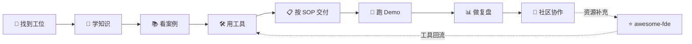

# 🗺️ GoldenTellus 仓库总导航

不知道去哪时，从你的目标开始选。每条路径都可以继续向上游补知识、向下游做验证。

## 🚦 按需求直达

| 你的需求 | 第一站 | 推荐下一站 |
|---|---|---|
| 学习 FDE、规划成长 | 🧭 [goldentellus-roadmap](https://github.com/GoldenTellus/goldentellus-roadmap) | 🧠 [goldentellus-knowledge](https://github.com/GoldenTellus/goldentellus-knowledge) |
| 了解 AI 落地案例 | 📚 [goldentellus-cases](https://github.com/GoldenTellus/goldentellus-cases) | 🧪 [goldentellus-demos](https://github.com/GoldenTellus/goldentellus-demos) |
| 拆解需求或设计架构 | 🛠️ [goldentellus-toolkit](https://github.com/GoldenTellus/goldentellus-toolkit) | 📋 [goldentellus-playbooks](https://github.com/GoldenTellus/goldentellus-playbooks) |
| 编写并运行 Demo | 🧪 [goldentellus-demos](https://github.com/GoldenTellus/goldentellus-demos) | 📚 [goldentellus-cases](https://github.com/GoldenTellus/goldentellus-cases) |
| 查 SOP、模板和交接协议 | 📋 [goldentellus-playbooks](https://github.com/GoldenTellus/goldentellus-playbooks) | 🤝 [goldentellus-community](https://github.com/GoldenTellus/goldentellus-community) |
| 查工具、文章、框架和资源 | ⭐ [awesome-fde](https://github.com/GoldenTellus/awesome-fde) | 🛠️ [goldentellus-toolkit](https://github.com/GoldenTellus/goldentellus-toolkit) |
| 做行业研究或复盘 | 📊 [goldentellus-reports](https://github.com/GoldenTellus/goldentellus-reports) | 📚 [goldentellus-cases](https://github.com/GoldenTellus/goldentellus-cases) |
| 参与讨论、活动或组队 | 🤝 [goldentellus-community](https://github.com/GoldenTellus/goldentellus-community) | [贡献指南](CONTRIBUTING.md) |

## 🔁 按流水线串联

## 🗂️ 仓库职责地图

| 仓库 | 你会找到什么 | 典型入口 |
|---|---|---|
| 🏠 [goldentellus-home](https://github.com/GoldenTellus/goldentellus-home) | 总导航、受众入口、贡献入口 | 不知道去哪 |
| 🧭 [goldentellus-roadmap](https://github.com/GoldenTellus/goldentellus-roadmap) | 学习路径、技能矩阵、成长地图 | 想学什么 |
| 🧠 [goldentellus-knowledge](https://github.com/GoldenTellus/goldentellus-knowledge) | Pipeline 基础与角色知识 | 想掌握方法 |
| 📚 [goldentellus-cases](https://github.com/GoldenTellus/goldentellus-cases) | 按行业、阶段、复杂度整理的案例 | 想看真实问题 |
| 🛠️ [goldentellus-toolkit](https://github.com/GoldenTellus/goldentellus-toolkit) | 分析器、脚手架、计算器、Prompt 和报告工具 | 想提高效率 |
| 📋 [goldentellus-playbooks](https://github.com/GoldenTellus/goldentellus-playbooks) | 角色 SOP、协作协议、模板和检查清单 | 想规范交付 |
| 🧪 [goldentellus-demos](https://github.com/GoldenTellus/goldentellus-demos) | 可启动、可演示、可复现的 Demo | 想验证方案 |
| 📊 [goldentellus-reports](https://github.com/GoldenTellus/goldentellus-reports) | 行业简报、研究报告、季度回顾 | 想看趋势和证据 |
| ⭐ [awesome-fde](https://github.com/GoldenTellus/awesome-fde) | 外部工具、框架、文章、岗位和社群 | 想找资源 |
| 🤝 [goldentellus-community](https://github.com/GoldenTellus/goldentellus-community) | 治理、讨论、活动、成员和合作记录 | 想参与协作 |

## 🧩 按角色查找

| 角色 | 先看 | 配套仓库 |
|---|---|---|
| Lead FDE | [01-lead-fde](https://github.com/GoldenTellus/goldentellus-knowledge/tree/main/01-lead-fde) | [playbooks](https://github.com/GoldenTellus/goldentellus-playbooks/tree/main/role-playbooks)、community |
| Analyst | [02-analyst](https://github.com/GoldenTellus/goldentellus-knowledge/tree/main/02-analyst) | toolkit、cases |
| Architect | [03-architect](https://github.com/GoldenTellus/goldentellus-knowledge/tree/main/03-architect) | toolkit、playbooks |
| Builder | [04-builder](https://github.com/GoldenTellus/goldentellus-knowledge/tree/main/04-builder) | demos、toolkit |
| Data Engineer | [05-data-engineer](https://github.com/GoldenTellus/goldentellus-knowledge/tree/main/05-data-engineer) | toolkit、reports |
| Integrator | [06-integrator](https://github.com/GoldenTellus/goldentellus-knowledge/tree/main/06-integrator) | demos、playbooks |
| Ops | [07-ops](https://github.com/GoldenTellus/goldentellus-knowledge/tree/main/07-ops) | reports、community |

## 🤝 想贡献什么？

- 文章或方法：提交到 `goldentellus-knowledge`。
- 脱敏案例：提交到 `goldentellus-cases`，并关联 Demo（如有）。
- 可运行代码：提交到 `goldentellus-demos` 或 `goldentellus-toolkit`。
- SOP、模板或检查清单：提交到 `goldentellus-playbooks`。
- 外部资源：提交到 `awesome-fde`，注明来源和维护状态。
- 讨论、活动或组队：提交到 `goldentellus-community`。
- 研究、简报或复盘：提交到 `goldentellus-reports`。

提交前请先阅读[贡献指南](CONTRIBUTING.md)，再确认目标仓库的 README、模板和许可证要求。
